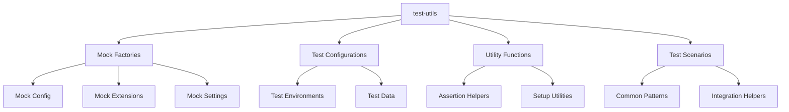

[根目录](../../CLAUDE.md) > [packages](../) > **test-utils**

# Test Utils 模块文档

## 变更记录 (Changelog)

**2025-11-24**: 首次模块文档生成，基于测试工具配置分析

## 模块职责

Test Utils 模块为整个 Gemini CLI 项目提供共享的测试工具和辅助函数。主要职责包括：

- 🧪 **测试辅助**: 提供通用的测试工具函数和模拟数据
- 🏭 **模拟工厂**: 创建模拟配置、扩展和测试环境
- 🔧 **测试配置**: 统一的测试配置和设置
- 📊 **测试工具**: 专用测试工具和验证函数
- 🎯 **测试场景**: 常见测试场景的预置配置

## 入口与启动

### 📍 主要入口文件

**主入口**: `packages/test-utils/src/index.ts`
- 导出所有公共测试工具
- 模块组织和接口暴露
- 依赖管理和配置

**配置文件**: `packages/test-utils/package.json`
- 包配置和依赖管理
- 构建脚本和类型检查
- 私有包标记

### 🚀 测试工具架构



## 对外接口

### 🏭 模拟工厂

**配置模拟**: 从 Core 模块导入
```typescript
// 从 @google/gemini-cli-core 导入
export { makeFakeConfig } from '@google/gemini-cli-core';
```

**测试环境创建**:
```typescript
// 典型的工厂函数结构
interface TestConfig {
  apiKey?: string;
  model?: string;
  tools?: Tool[];
  policies?: Policy[];
}

export function createTestConfig(overrides?: Partial<TestConfig>): TestConfig;
```

**扩展模拟**:
```typescript
interface TestExtension {
  name: string;
  version: string;
  commands: Command[];
  enabled: boolean;
}

export function createTestExtension(overrides?: Partial<TestExtension>): TestExtension;
```

### 🔧 测试工具函数

**设置工具**:
```typescript
// 测试环境设置
export function setupTestEnvironment(): Promise<void>;
export function cleanupTestEnvironment(): Promise<void>;

// 模拟数据生成
export function generateMockFile(path: string, content: string): MockFile;
export function generateMockMessage(role: string, content: string): MockMessage;
```

**断言助手**:
```typescript
// 专用断言函数
export function assertConfigValid(config: Config): void;
export function assertCommandResult(result: CommandResult): void;
export function assertExtensionLoaded(extension: Extension): void;
```

### 📊 测试场景

**集成测试场景**:
```typescript
// 常见测试场景
export function setupBasicConversation(): Promise<ConversationTestContext>;
export function setupExtensionTest(extension: TestExtension): Promise<ExtensionTestContext>;
export function setupMCPIntegration(): Promise<MCPTestContext>;
```

## 关键依赖与配置

### 📦 核心依赖

**内部依赖**:
- `@google/gemini-cli-core`: 导入核心模拟函数
- 其他测试包的共享配置

**开发依赖**:
- `typescript`: ^5.3.3+ - TypeScript 编译器
- 主要用于类型定义和编译检查

### ⚙️ 测试配置

**包配置**:
```json
{
  "name": "@google/gemini-cli-test-utils",
  "version": "0.19.0-nightly.20251124.e177314a4",
  "private": true,
  "main": "src/index.ts",
  "license": "Apache-2.0",
  "type": "module"
}
```

**NPM 脚本**:
```json
{
  "build": "node ../../scripts/build_package.js",
  "typecheck": "tsc --noEmit"
}
```

**TypeScript 配置**:
- 继承根级 TypeScript 配置
- 严格模式编译
- 完整类型检查

## 数据模型

### 🧪 测试数据结构

**模拟配置**:
```typescript
interface MockConfig extends Config {
  // 测试特定配置
  testMode: boolean;
  mockResponses: boolean;
  skipAuth: boolean;
}
```

**测试上下文**:
```typescript
interface TestContext {
  // 测试环境信息
  workspace: TestWorkspace;
  config: MockConfig;
  extensions: TestExtension[];
  // 清理函数
  cleanup: () => Promise<void>;
}
```

**模拟数据**:
```typescript
interface MockFile {
  path: string;
  content: string;
  encoding: BufferEncoding;
  modifiedTime: Date;
}

interface MockMessage {
  role: 'user' | 'assistant' | 'system';
  content: string;
  timestamp: number;
}
```

### 🎯 测试场景模型

**集成测试场景**:
```typescript
interface IntegrationTestScenario {
  name: string;
  description: string;
  setup: () => Promise<TestContext>;
  execute: (context: TestContext) => Promise<TestResult>;
  cleanup?: (context: TestContext) => Promise<void>;
}
```

**扩展测试场景**:
```typescript
interface ExtensionTestScenario {
  extension: TestExtension;
  commands: TestCommand[];
  expectedBehaviors: ExpectedBehavior[];
}
```

## 测试与质量

### 🧪 测试策略

**自测试**: 测试工具本身的测试
- 工具函数的正确性验证
- 模拟数据的完整性检查
- 测试场景的有效性确认

**集成验证**:
- 与实际测试套件的兼容性
- 性能影响评估
- 维护性检查

### 📊 质量保证

**类型安全**:
- TypeScript 严格模式
- 完整的接口定义
- 运行时类型检查

**文档完整性**:
- 每个工具函数的详细文档
- 使用示例和最佳实践
- 常见陷阱和注意事项

## 常见问题 (FAQ)

### ❓ 如何使用模拟工厂？

从 `@google/gemini-cli-test-utils` 导入 `makeFakeConfig` 函数，传入覆盖参数来创建测试配置。

### ❓ 如何创建自定义测试场景？

实现 `TestScenario` 接口，提供 setup、execute 和 cleanup 函数，确保资源的正确清理。

### ❓ 如何扩展测试工具？

在 `src/index.ts` 中添加新的导出函数，确保类型安全和文档完整性。

## 相关文件清单

### 📁 关键目录结构

```
packages/test-utils/src/
├── index.ts             # 主导出文件
├── factories/           # 模拟工厂
│   ├── config.ts       # 配置模拟
│   ├── extensions.ts   # 扩展模拟
│   └── data.ts         # 数据模拟
├── utils/               # 工具函数
│   ├── setup.ts        # 环境设置
│   ├── assertions.ts   # 断言助手
│   └── cleanup.ts      # 清理工具
├── scenarios/           # 测试场景
│   ├── basic.ts        # 基础场景
│   ├── integration.ts  # 集成场景
│   └── extensions.ts   # 扩展场景
└── types/               # 类型定义
    ├── config.ts       # 配置类型
    ├── test.ts         # 测试类型
    └── mock.ts         # 模拟类型
```

### 📄 重要文件

- `src/index.ts` - 主导出文件
- `package.json` - 包配置
- `tsconfig.json` - TypeScript 配置 (继承根级)

## 变更记录 (Changelog)

**2025-11-24**:
- 初始化模块文档
- 基于包配置和依赖分析
- 识别测试工具和模拟工厂功能