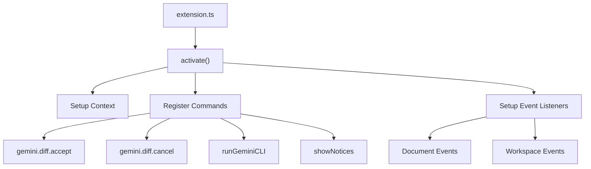

[根目录](../../CLAUDE.md) > [packages](../) > **vscode-ide-companion**

# VSCode IDE Companion 模块文档

## 变更记录 (Changelog)

**2025-11-24**: 首次模块文档生成，基于VS Code扩展配置分析

## 模块职责

VSCode IDE Companion 是一个 VS Code 扩展，提供 Gemini CLI 与 IDE 的深度集成。主要职责包括：

- 🔗 **IDE 集成**: VS Code 编辑器与 Gemini CLI 的无缝连接
- 📝 **代码差异视图**: 可视化显示 Gemini CLI 的代码修改建议
- ⚡ **快速操作**: 通过快捷键和命令面板快速访问 Gemini 功能
- 🎨 **差异编辑器**: 专门的差异编辑器，支持接受/拒绝修改
- 🔌 **MCP 服务器**: 内置 MCP 服务器支持，提供 IDE 数据访问
- 📊 **通知系统**: 扩展状态和操作结果通知

## 入口与启动

### 📍 主要入口文件

**扩展入口**: `packages/vscode-ide-companion/src/extension.ts`
- VS Code 扩展的激活入口点
- 上下文和事件监听器设置
- 命令和菜单注册

**构建入口**: `packages/vscode-ide-companion/extension.cjs`
- 编译后的主入口文件
- CommonJS 格式兼容 VS Code

### 🚀 激活流程



## 对外接口

### 🔧 VS Code 命令

**核心命令**:
```typescript
// 接受差异
"gemini.diff.accept": {
  title: "Gemini CLI: Accept Diff",
  icon: "$(check)"
}

// 取消差异
"gemini.diff.cancel": {
  title: "Gemini CLI: Close Diff Editor",
  icon: "$(close)"
}

// 运行 Gemini CLI
"gemini-cli.runGeminiCLI": {
  title: "Gemini CLI: Run"
}

// 查看第三方通知
"gemini-cli.showNotices": {
  title: "Gemini CLI: View Third-Party Notices"
}
```

### 🎨 用户界面组件

**差异编辑器**:
- 自定义语言标识符: `gemini-diff-editable`
- 可视化差异显示
- 键盘快捷键支持 (Ctrl+S/Cmd+S 接受)

**菜单集成**:
- 命令面板 (`Ctrl+Shift+P`)
- 编辑器标题菜单
- 右键上下文菜单

**键盘快捷键**:
```json
{
  "command": "gemini.diff.accept",
  "key": "ctrl+s",
  "when": "gemini.diff.isVisible"
},
{
  "command": "gemini.diff.accept",
  "key": "cmd+s",
  "when": "gemini.diff.isVisible"
}
```

### 🔌 MCP 服务器集成

**Express 服务器**:
- 提供 HTTP API 接口
- 支持工作区文件访问
- Git 仓库信息查询

**WebSocket 支持**:
- 实时事件通信
- 状态同步
- 操作结果推送

## 关键依赖与配置

### 📦 核心依赖

**VS Code API**:
- `@types/vscode`: ^1.99.0+ - VS Code 类型定义
- `@vscode/vsce`: ^3.6.0+ - VS Code 扩展打包工具

**Web 框架**:
- `express`: 5.1.0+ - HTTP 服务器
- `cors`: 2.8.5+ - 跨域资源共享

**MCP 支持**:
- `@modelcontextprotocol/sdk`: ^1.22.0+ - MCP 协议支持
- `zod`: ^3.25.76+ - 数据验证

**开发工具**:
- `typescript`: ^5.8.3+ - TypeScript 编译器
- `esbuild`: ^0.25.3+ - 快速构建工具
- `vitest`: ^3.2.4+ - 测试框架

### ⚙️ 扩展配置

**扩展清单**: `packages/vscode-ide-companion/package.json`
```json
{
  "name": "gemini-cli-vscode-ide-companion",
  "displayName": "Gemini CLI Companion",
  "description": "Enable Gemini CLI with direct access to your IDE workspace.",
  "version": "0.19.0-nightly.20251124.e177314a4",
  "publisher": "google",
  "engines": {
    "vscode": "^1.99.0"
  },
  "categories": ["AI"],
  "activationEvents": ["onStartupFinished"]
}
```

**配置选项**:
```json
{
  "configuration": {
    "title": "Gemini CLI",
    "properties": {
      "gemini-cli.debug.logging.enabled": {
        "type": "boolean",
        "default": false,
        "description": "Enable detailed logging for debugging the Gemini CLI Companion."
      }
    }
  }
}
```

### 🔨 构建配置

**ESBuild 配置**: `packages/vscode-ide-companion/esbuild.js`
- TypeScript 编译和打包
- 开发和生产模式
- 热重载支持

**NPM 脚本**:
```json
{
  "build": "npm run build:dev",
  "build:dev": "npm run check-types && npm run lint && node esbuild.js",
  "build:prod": "node esbuild.js --production",
  "package": "vsce package --no-dependencies"
}
```

## 数据模型

### 📊 扩展状态

**差异视图状态**:
```typescript
interface DiffViewState {
  isVisible: boolean;
  originalContent: string;
  modifiedContent: string;
  filePath: string;
  timestamp: Date;
}
```

**工作区信息**:
```typescript
interface WorkspaceInfo {
  name: string;
  rootPath: string;
  files: string[];
  gitRepository?: GitRepositoryInfo;
}
```

### 🔌 MCP 服务器数据

**文件系统信息**:
```typescript
interface FileSystemInfo {
  path: string;
  content: string;
  encoding: string;
  modifiedTime: Date;
}

interface GitRepositoryInfo {
  branch: string;
  remoteUrl: string;
  status: GitStatus;
}
```

## 测试与质量

### 🧪 测试结构

**单元测试**: 使用 Vitest
- 扩展激活测试
- 命令处理测试
- MCP 服务器测试

**集成测试**:
- VS Code 扩展测试
- 差异编辑器功能测试
- 服务器通信测试

### 📊 质量保证

**类型安全**:
- TypeScript 严格模式
- VS Code API 类型定义
- Zod 运行时验证

**代码质量**:
- ESLint 配置: TypeScript 规则
- Prettier 格式化
- TypeScript 编译检查

**发布流程**:
- 自动化版本管理
- 第三方通知生成
- VS Code 市场验证

## 常见问题 (FAQ)

### ❓ 如何调试扩展？

启用 `gemini-cli.debug.logging.enabled` 配置，并查看 VS Code 开发者工具的输出面板。

### ❓ 如何添加新的 VS Code 命令？

在 `extension.ts` 中注册新命令，并在 `package.json` 的 `contributes.commands` 中声明。

### ❓ 如何修改差异编辑器行为？

差异编辑器通过上下文变量 `gemini.diff.isVisible` 控制，可以通过命令和快捷键进行交互。

## 相关文件清单

### 📁 关键目录结构

```
packages/vscode-ide-companion/
├── src/                   # 源代码
│   ├── extension.ts      # 扩展入口
├── scripts/              # 构建脚本
│   ├── generate-notices.js # 通知生成
│   └── validate-notices.js  # 通知验证
├── assets/               # 资源文件
│   └── icon.png         # 扩展图标
├── esbuild.js           # 构建配置
├── tsconfig.json        # TypeScript 配置
└── package.json         # 扩展清单
```

### 📄 重要文件

- `src/extension.ts` - 扩展入口和命令注册
- `package.json` - 扩展清单和配置
- `esbuild.js` - 构建脚本
- `scripts/generate-notices.js` - 第三方通知生成

## 变更记录 (Changelog)

**2025-11-24**:
- 初始化模块文档
- 基于 VS Code 扩展配置分析
- 识别差异编辑器和 MCP 服务器功能